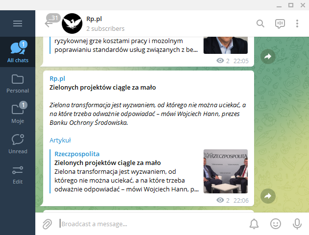

<div align="center">



</div>

<div align="center">

[](https://standardjs.com/)
[](https://telegram.dog/rzeczpospolitapl)

</div>

***

<h4 align="center">Rzeczpospolita Bot</h4>


<p align="center">
  <a href="#about">About</a> •
  <a href="#development">Development</a> •
  <a href="#deployment">Deployment</a>
</p>

<p align="center">
<table>
<tbody>
<td align="center">
<br>
Website: <b><a href="https://t.me/rzeczpospolitapl">https://t.me/rzeczpospolitapl 💬</a></b><br>

</td>
</tbody>
</table>
</p>

## About

Rzeczpspolita.pl bot is a RSS reader that notifies the telegram channel of new articles on the rp.pl website every 10 minutes.

Requirements:

- MongoDB (I am using free plan on [mongodb.com](https://www.mongodb.com/))
- Telegram bot token
- Deployment can be done on Heroku for free with scheduler

## Development

You need to create a MongoDB, Telegram bot at @botfather and create an Wykop API key.

1. Install dependencies with `npm install`.
1. Configure `.env`. Template is available in `.env.template`.
1. Run locally `npm run start`.


## Deployment

Add `heroku.buildpack-nodejs` buildpack with:

```
heroku buildpacks:add https://github.com/heroku/heroku-buildpack-nodejs.git
```

Add environmental variables in heroku dashboard.

Add scheduler for job `npm start`. More about scheduling [here](https://devcenter.heroku.com/articles/scheduler).
